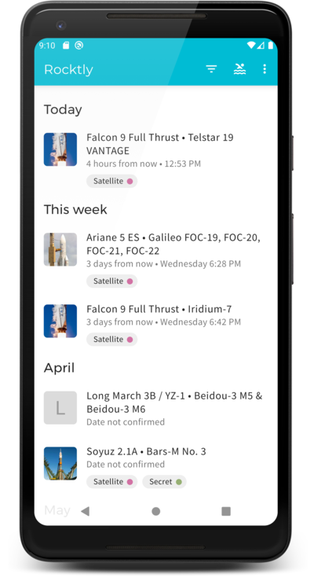
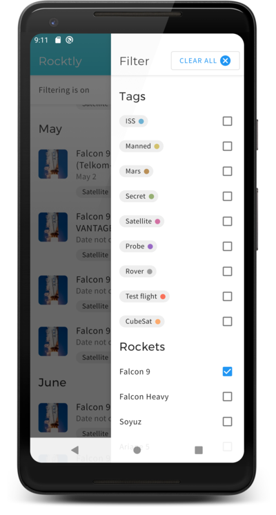
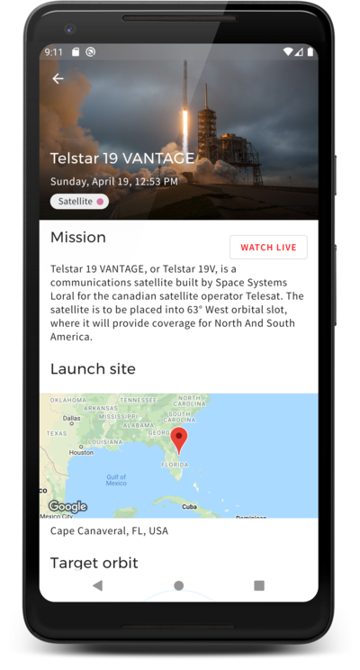
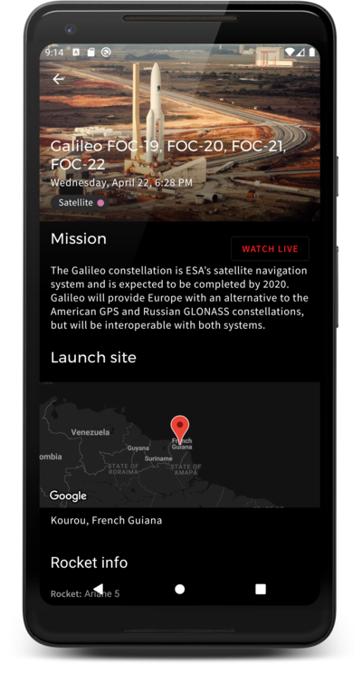
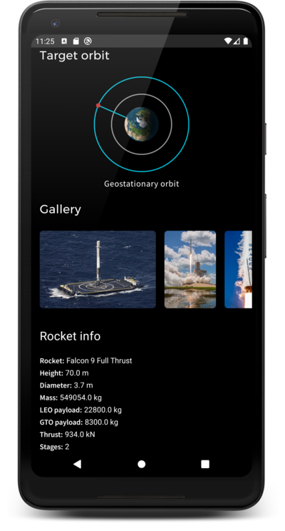

# Rocktly: Rocket launches schedule (Work in progress 🚧👷🏗️‍️)

🚨 App is currently being rewritten to compose 🚨

An android app that shows timeline of upcoming rocket launches. Showcases architecture of a real android application and usage of some libraries. Application loads data about rocket launches from the server and stores them to the database for off-line usage.

### Screenshots

|  |  |  |
| ---------------------------------------------------- | ---------------------------------------------------- | ---------------------------------------------------- |
|  |  |  |

### Goals

- Modularize the application into modules `App` and `Domain`. `Domain` module has no android dependencies.
- Focus on testability with unit tests and UI tests. For UI tests is used the Espresso library with the [Robot pattern](https://academy.realm.io/posts/kau-jake-wharton-testing-robots/) which allows to create clear and understandable tests.
- Use kotlin coroutines for asynchronous jobs.

### Libraries Used

- [ViewModel](https://developer.android.com/topic/libraries/architecture/viewmodel) - Store UI-related data that isn't destroyed on app rotations.
- [Room](https://developer.android.com/topic/libraries/architecture/room) - Store launch data received from the server in SQLite database.
- [Data Binding](https://developer.android.com/topic/libraries/data-binding/) - Declaratively bind observable data to UI elements.
- [Lifecycles](https://developer.android.com/topic/libraries/architecture/lifecycle) - Handle events from ViewModel to Fragments/Activity.
- [WorkManager](https://developer.android.com/topic/libraries/architecture/workmanager) - Used for periodic data fetching from server and for showing Android notification of upcoming launch.
- [Navigation](https://developer.android.com/topic/libraries/architecture/navigation/) - Handle everything needed for navigation between fragments and creation of deep links.
- [Kotlin Coroutines](https://kotlinlang.org/docs/reference/coroutines-overview.html) For managing asynchronous calls with simplified code and reducing needs for callbacks. For event based code are used `Flow`-s and `Channel`-s.
- Dependency injection
  - [Dagger 2](https://github.com/google/dagger) Creates dependency graph for most object in the application.
  - [Assited-Inject](https://github.com/square/AssistedInject) Easier creation of objects that combine parameterization and dependencies. Mainly used with ViewModels.

- [Material components](https://github.com/material-components/material-components-android) Application uses material theme for easier styling of UI components and for dark theme.  

### Getting started

- Server for app isn't currently running publicly. App should work even without server, when is build with parameter `use_fake_reponse_api=true` in the `gradle.properiets`. In this case the response is generated from static JSON from the assets.

#### Gradle tasks

- run UI tests on connected device:
`./gradlew connectedDebugAndroidTest`

- run unit tests:
`./gradlew testDebugUnitTest`

- assemble apk:
`./gradlew assembleDebug`

#### Environment variables (optional)

- `SPACE_APP_KEYSTORE_PASSWORD`

- `SPACE_APP_KEY_PASSWORD`

- `SPACE_APP_KEYSTORE_PATH`

- `SPACE_APP_API_KEY` - key will be used for communication with server, but is recommended for now to use `use_fake_reponse_api=true ` parameter in the `gradle.properiets`.

- `SPACE_APP_GOOGLE_MAPS_KEY` - use a google maps api key and replace google-services.json file, if you want to show the map in the Launch detail.


### License

```
Copyright 2014 Valter Kasper

Licensed under the Apache License, Version 2.0 (the "License");
you may not use this file except in compliance with the License.
You may obtain a copy of the License at

   http://www.apache.org/licenses/LICENSE-2.0

Unless required by applicable law or agreed to in writing, software
distributed under the License is distributed on an "AS IS" BASIS,
WITHOUT WARRANTIES OR CONDITIONS OF ANY KIND, either express or implied.
See the License for the specific language governing permissions and
limitations under the License.
```
